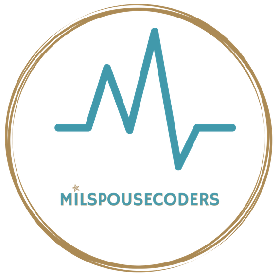

# MSC Professional Resources

#

## Table of Contents:
- [Women Focused Organizations](#women-focused-organizations)
- [Job Sites](#job-sites)

#

## Women Forcused Organizations
- [Society of Women Engineers](https://swe.org/) - For more than six decades, SWE has given women engineers a unique place and voice within the engineering industry. Our organization is centered around a passion for our members' success and continues to evolve with the challenges and opportunities reflected in today's exciting engineering and technology specialties. **Membership required**

- [Women in Tech](https://wit.memberclicks.net/home) - Women in Technology (WIT) has the sole aim of advancing women in technology -- from the classroom to the boardroom.  WIT meets its vision through a variety of leadership development, technology education, networking and mentoring opportunities for women at all levels of their careers. WIT has over 1000 members in the Washington, D.C./Maryland/Virginia metro region. **Membership required** 

- [Tech Ladies](https://www.hiretechladies.com/) - Tech Ladies is a worldwide community with 100,000 members. Through a supportive online group, a free job board, and opportunities to learn, we help Tech Ladies grow their careers.

## Job Sites
- [Dice](https://www.dice.com/) - Tech specifc
- [Prism](https://prismnetwork.org/) - Higher Ed

# Contributing

Please checkout the [CONTRIBUTING.md](CONTRIBUTING.md) file for information on how to contribute!

# Code of Conduct

MSC Code of Conduct rules can be found [here](CODE_OF_CONDUCT.md).
